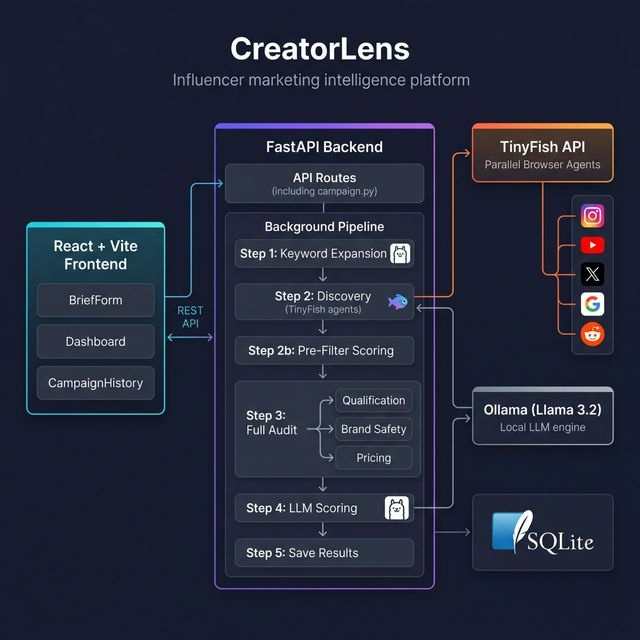

<div align="center">
  <h1>🎯 CreatorLens</h1>
  <p><b>Find the Right Influencer. Verify Them. Know What to Pay.</b></p>
</div>

An influencer marketing intelligence platform that automates the entire pre-campaign workflow — discovery, qualification, brand safety audit, and pricing — using parallel **TinyFish browser agents** and **local LLM scoring** (Ollama).

Built for the **TinyFish × HackerEarth $2M Pre-Accelerator Hackathon 2026**.

### Built With


---

## ✨ Features

- **Automated Discovery**: Submit a brand brief, and our LLM expands it into search keywords to find the best-fit creators.
- **Parallel AI Agents**: Fires over 100 parallel browser agents across Instagram, Twitter, and YouTube to gather data simultaneously.
- **Brand Safety Audit**: Autonomous agents scan Google, Reddit, and Twitter/X to ensure candidates are safe for your brand.
- **Fair Pricing Engine**: Benchmarks influencer rates against market standards to ensure you don't overpay.
- **Intelligent Scoring**: Ranks candidates based on engagement quality, brand fit, risk score, and price fairness using Llama 3.2.
- **Competitor Intel**: Discover influencers and brand ambassadors already working with competitor brands.
- **Campaign History**: Automatically caches previous pipeline runs and statuses, accessible at any time via a dedicated history dashboard.
- **AI Outreach Drafting**: Generates context-aware, personalized influencer outreach messages instantly based on performance and niche.
- **Lightning Fast**: Generates a comprehensive, ranked top-5 dossier of vetted influencers in under 2 minutes.

---

## 🏗️ Architecture & Tech Stack

<div align="center">
  
  <p><i>High-level system architecture</i></p>
</div>

### Tech Stack

| Component | Technology |
|---|---|
| **Frontend** | React + Vite + Vanilla CSS |
| **Backend** | FastAPI (Python 3.11+) |
| **Agent Infrastructure** | TinyFish API (Parallel Browser Agents) |
| **LLM Engine** | Ollama (Llama 3.2, running locally) |
| **Database** | SQLite (Production-ready for Postgres migration) |

### Project Structure

```
CreatorLens/
├── backend/
│   ├── main.py                  # FastAPI app entry point, CORS, router registration
│   ├── routes/
│   │   └── campaign.py          # All API endpoints + background pipeline orchestrator
│   ├── services/
│   │   ├── tinyfish.py          # TinyFish browser agent calls (discovery, audit, pricing)
│   │   └── scoring.py           # Ollama LLM integration (scoring, keyword expansion, outreach)
│   ├── models/
│   │   └── schemas.py           # Pydantic request/response models (BrandBrief, InfluencerDossier)
│   ├── db/
│   │   └── database.py          # SQLite database init, CRUD operations
│   └── creatorlens.db           # SQLite database file
├── frontend/
│   └── src/
│       ├── App.jsx              # Root component, screen routing (form → loading → results)
│       ├── App.css              # Global styles & design system
│       └── components/
│           ├── BriefForm.jsx    # Brand brief input form
│           ├── Dashboard.jsx    # Results dashboard with dossier cards, polling, outreach
│           └── CampaignHistory.jsx  # Past campaign history viewer
└── docker-compose.yml           # Container orchestration for deployment
```

### System Components

```
┌──────────────────────────────────────────────────────────────────────┐
│  FRONTEND (React + Vite)       http://localhost:5173                 │
│  ┌─────────────┐ ┌──────────────────┐ ┌───────────────────────┐     │
│  │  BriefForm   │ │    Dashboard     │ │  CampaignHistory      │     │
│  │ (Submit Brief)│ │ (Polling + Cards)│ │ (Past Campaigns)      │     │
│  └──────┬───────┘ └────────┬─────────┘ └──────────┬────────────┘     │
│         │  POST /run-campaign  GET /status/:id     │ GET /campaigns  │
└─────────┼──────────────────┼──────────────────────┼─────────────────┘
          │    REST API      │                      │
┌─────────▼──────────────────▼──────────────────────▼─────────────────┐
│  BACKEND (FastAPI)             http://localhost:8000                 │
│  ┌──────────────────────────────────────────────────────────┐       │
│  │  Routes (campaign.py)                                     │       │
│  │  • POST /api/run-campaign    → launch background pipeline │       │
│  │  • GET  /api/status/:id      → poll job status + results  │       │
│  │  • GET  /api/campaigns       → list campaign history      │       │
│  │  • POST /api/outreach/:id/:h → generate outreach message  │       │
│  │  • POST /api/competitor-intel→ find competitor influencers │       │
│  │  • POST /api/cancel-agents   → emergency stop all agents  │       │
│  └──────────────────────────────────────────────────────────┘       │
│                              │                                      │
│  ┌───────────────────────────▼──────────────────────────────┐       │
│  │  Background Pipeline (execute_pipeline)                   │       │
│  │  Step 1 → Step 2 → Step 2b → Step 3 → Step 4 → Step 5   │       │
│  └──────────────────────────────────────────────────────────┘       │
│         │                    │                    │                  │
│  ┌──────▼───────┐  ┌────────▼────────┐  ┌───────▼────────┐         │
│  │  scoring.py   │  │  tinyfish.py    │  │  database.py   │         │
│  │  (Ollama LLM) │  │  (Browser Agents│  │  (SQLite CRUD) │         │
│  └──────┬────────┘  └────────┬────────┘  └───────┬────────┘         │
└─────────┼────────────────────┼────────────────────┼─────────────────┘
          │                    │                    │
  ┌───────▼────────┐  ┌───────▼─────────────┐  ┌──▼──────────┐
  │  Ollama         │  │ TinyFish API         │  │  SQLite DB  │
  │  (Llama 3.2)    │  │ (Parallel Browsers)  │  │             │
  │  localhost:11434 │  │  → Instagram         │  └─────────────┘
  └─────────────────┘  │  → YouTube           │
                       │  → Twitter/X         │
                       │  → Google            │
                       │  → Reddit            │
                       └──────────────────────┘
```

### Pipeline Data Flow

The core pipeline runs as a **background task** after a brand brief is submitted:

```
Brand Brief
    │
    ▼
┌──────────────────────────────────────────────────────────────┐
│ Step 1: Keyword Expansion (Ollama)                           │
│ LLM generates 5-8 search keywords from the brief            │
└──────────────────────┬───────────────────────────────────────┘
                       ▼
┌──────────────────────────────────────────────────────────────┐
│ Step 2: Discovery (TinyFish Agents)                          │
│ Parallel browser agents search Instagram, YouTube, Twitter   │
│ for influencer profiles matching keywords                    │
│                                                              │
│ + Optional: Competitor Intel agents run in parallel           │
└──────────────────────┬───────────────────────────────────────┘
                       ▼
┌──────────────────────────────────────────────────────────────┐
│ Step 2b: Pre-Filter Scoring (Local)                          │
│ Heuristic filter: follower floor (5K), spam handle detection,│
│ platform weighting, fake-follower signals → Top 10 selected  │
└──────────────────────┬───────────────────────────────────────┘
                       ▼
┌──────────────────────────────────────────────────────────────┐
│ Step 3: Full Audit (TinyFish — 3 agents per profile)         │
│ For each of the top 10 profiles, fires 3 agents in parallel: │
│   • Qualification → engagement stats from profile pages      │
│   • Brand Safety  → controversy scan via Google/Reddit/X     │
│   • Pricing       → market rate benchmarks via Google         │
│                                                              │
│ Hard filters applied: min engagement rate, follower mismatch │
│ Post-audit re-ranking by engagement + risk + price fit       │
└──────────────────────┬───────────────────────────────────────┘
                       ▼
┌──────────────────────────────────────────────────────────────┐
│ Step 4: LLM Scoring & Summarization (Ollama)                 │
│ Llama 3.2 scores each candidate on 4 weighted dimensions:    │
│   • Engagement Quality (40%)                                 │
│   • Audience Authenticity (30%)                              │
│   • Niche Relevance (20%)                                    │
│   • Brand Safety (10%)                                       │
│ Generates AI summary + composite score per influencer        │
└──────────────────────┬───────────────────────────────────────┘
                       ▼
┌──────────────────────────────────────────────────────────────┐
│ Step 5: Persist Results (SQLite)                             │
│ Ranked dossiers saved to DB, job marked complete             │
└──────────────────────┬───────────────────────────────────────┘
                       ▼
              Ranked Influencer Dossier
              (Dashboard renders results)
```

---

## 🚀 Getting Started

### Prerequisites

- **Node.js** (v18+)
- **Python** (3.11+)
- **[Ollama](https://ollama.ai)** installed and running locally
- **TinyFish API Key** from [tinyfish.ai](https://tinyfish.ai)

### 1. Backend Setup

Begin by setting up the Python FastAPI backend.

```bash
cd backend

# Create and activate virtual environment
python -m venv venv
venv\Scripts\activate  # Windows
# source venv/bin/activate  # macOS/Linux

# Install dependencies (FastAPI, Uvicorn, Python-dotenv, HTTPX)
pip install fastapi uvicorn python-dotenv httpx
```

Create a `.env` file in the `backend/` directory:

```env
TINYFISH_API_KEY=sk-tinyfish-your-key-here
OLLAMA_BASE_URL=http://localhost:11434
OLLAMA_MODEL=llama3.2
```

Pull the local LLM model and start the backend server:

```bash
# Ensure Ollama is running, then pull the model
ollama pull llama3.2

# Start the FastAPI server
uvicorn main:app --reload --port 8000
```
*API docs will be available at [http://localhost:8000/docs](http://localhost:8000/docs)*

### 2. Frontend Setup

In a new terminal, configure and start the React frontend.

```bash
cd frontend

# Install dependencies
npm install

# Start the Vite development server
npm run dev
```
*The web interface will be available at [http://localhost:5173](http://localhost:5173)*

---

## 📖 How to Use

1. Navigate to **[http://localhost:5173](http://localhost:5173)**.
2. Fill out the **Brand Brief** with your niche, target audience, budget, platforms, and keywords.
3. Submit the brief. The platform will dispatch parallel AI agents to discover, audit, and price influencers.
4. Once completed (usually ~2 mins), view your **Influencer Dashboard**, complete with detailed dossiers, safety flags, and AI-generated summaries.

---

## 🔌 API Documentation

### `POST /api/run-campaign`
Submits a generated brand brief. Returns a `job_id` to poll for results. The pipeline runs asynchronously in the background.

**Request Body:**
```json
{
  "niche": "fitness supplements",
  "target_audience": "men 18-35 India",
  "budget_min": 500,
  "budget_max": 5000,
  "platforms": ["instagram", "youtube"],
  "keywords": ["protein shake", "gym workout", "bodybuilding"]
}
```

**Response:**
```json
{
  "job_id": "b7f239c6-1234-...",
  "status": "pending",
  "results": null
}
```

### `GET /api/status/{job_id}`
Poll this endpoint to check job status (`pending` → `running` → `complete` | `failed`).

**Response (when complete):**
```json
{
  "job_id": "b7f239c6-...",
  "status": "complete",
  "results": [
    {
      "handle": "cbum",
      "platform": "instagram",
      "followers": 26000000,
      "engagement_rate": 0.58,
      "risk_flag": "green",
      "risk_sources": [],
      "price_low": 50000,
      "price_high": 150000,
      "composite_score": 87.4,
      "ai_summary": "Chris Bumstead is a dominant figure in the fitness..."
    }
  ]
}
```

### `GET /api/campaigns`
Fetches a list of the 20 most recent campaign jobs and their statuses from the database.

### `POST /api/outreach/{job_id}/{handle}`
Generates a concise, personalized outreach message for a specifically analyzed influencer using their stats and the original brand brief.

### `POST /api/competitor-intel`
Searches for influencers and brand ambassadors who have sponsored partnerships with a specified competitor brand.

**Request Body:**
```json
{
  "competitor_brand": "Gymshark"
}
```

### `POST /api/cancel-agents`
An emergency stop endpoint that cancels all currently active TinyFish agents.

---

## 🤖 Agent Pipeline Explained

Four agent types run in parallel via `asyncio.gather` for maximum temporal efficiency:

| Agent | Task | Data Sources |
|---|---|---|
| **Discovery** | Find matching profiles by keyword | Instagram, Twitter, YouTube |
| **Qualification** | Pull engagement stats per profile | Platform profile pages |
| **Audit** | Brand safety & sentiment check | Google, Reddit, Twitter/X |
| **Pricing** | Rate benchmarks & estimations | Google Search (live market data) |
| **Competitor**| Discover competitor partnerships | Google Search (sponsored posts) |

---

## 🛡️ The Moat (Why this matters)

Manually vetting 20 influencers across 6 platforms takes **3 days** of human labor. CreatorLens does it in **under 2 minutes** by running all agents simultaneously. The audit step alone — cross-referencing each individual influencer across news outlets, Reddit communities, and Twitter/X — is impossible at this speed without parallel browser agents.

CreatorLens doesn't just find influencers; it guarantees they align with your brand's reputation and budget instantly.